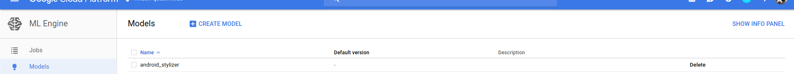
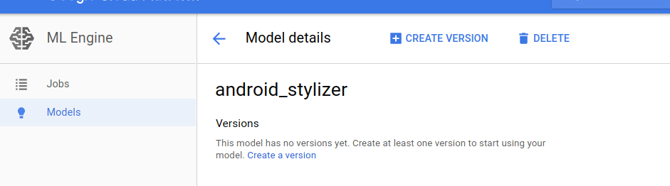

Android TensorFlow sample: Stylizer using Cloud Machine Learning Engine backend (CMLE)
=====================================================================================

This sample demonstrates how to use TensorFlow to apply artistic styles to photos
by using Google CMLE as backend with a pre-trained TensorFlow model. It consists of
a frontend Android app and a backend TensorFlow model deployed on CMLE instance.
The app can take a photo, select one of the artistic styles from style carousel to
send a JSON request to CMLE model, and get back a stylized photo.

This sample is a derivative of the [TensorFlow Android Demo TF_Stylize app](https://github.com/tensorflow/tensorflow/blob/master/tensorflow/examples/android/).
In that sample a pre-trained TensorFlow model graph is loaded onto device
and TensorFlow inference is run locally to render stylized photos on the fly. 

The original TensorFlow model of image stylization is open sourced as part of the
[Magenta project](https://github.com/tensorflow/magenta/tree/master/magenta/models/image_stylization) by the Google Brain team. 

The following two sections are detailed steps on how to set up your own online prediction backend service on CMLE
and how to build the frontend Andnroid app.  

0. Set up online prediction service on CMLE
0. Build the Android app

But first of all let's list the pre-requisites.

Pre-requisites
--------------

0. Android Studio 2.3+
0. Android phones/tablets running Nougat 7.1.2 (API level 25 or higher)
0. Set up a Google Cloud project using [Google Developer Console](https://developers.google.com/console) where you 
will set up your online prediction service backend
0. Create a [service account](https://cloud.google.com/compute/docs/access/create-enable-service-accounts-for-instances)
that your frontend Android client app will use to authenticate and access the online prediction service

Set up online prediction service on CMLE
========================================

## Overview

To set up your own online prediction service, you need to provide a SavedModel (the universal
serialization format for TensorFlow models). To make it easy for developers to quickly get up and
running, we have placed a SavedModel binary for this stylization model along with the corresponding
variables/ directory (which stores trained values for the model parameters) in a GCS bucket.  You can
simply point your ML Engine’s online prediction service to that bucket deploying the model for prediction. 

There are two abstractions that you need to be aware of when deploying a model to ML Engine’s online
prediction service:

0. Model: Represents a collection of different versions of given model. Each version could represent the
same model architecture trained on different datasets, or even iterations upon a single base architecture.
0. Version: Represents an atomic item in a model collection. We will deploy our stylizer SavedModel binary
as a version, v1, of a more general stylizer model.

Next listed are steps for deployment.

## Deployment

First inspect current cloud configuration by running:

```
gcloud config list
```

Pay attention to which account and project are selected. If necessary, set current project to the desired using:

```
gcloud config set project
```

### Model
First, we must create a model in your project, which we can do either from the Cloud Console or using the
gcloud command line tool as follows:
```
gcloud ml-engine models create <MODEL_NAME> --regions=<REGION_1>,<REGION_2>,...,<REGION_N>
```

For example, if we wanted to deploy the model under the name android_stylizer in the region us-central1, we would use the following command:
```
gcloud ml-engine models create android_stylizer --regions=us-central1
```

### Version
Next, let us deploy our SavedModel binary as a version of this model. Again, we could do so using the Cloud Console by selecting the model from the model dashboard:



and then clicking on the “CREATE VERSION” button:




We could also use the gcloud command line tool:
```
gcloud ml-engine versions create --model=<model-name> --origin=<local-path> --runtime-version=1.2 <version> --staging-bucket=<staging bucket>
```

Assuming you used the android_stylizer model name, you could deploy a v1 version of this model as:
```
gcloud ml-engine versions create --model=android_stylizer --origin=gs://stylizer-model/v1 --runtime-version=1.2 v1
```

Once the version has been deployed, we can start stylizing. To see the service work for yourself, download gs://stylizer-model/v1/request.json locally and try:
```
gcloud ml-engine predict --model=android_stylizer --json-instances=<PATH TO>/request.json
```

Build the Android app
==============================

0. Create service account key for [authentication credentials](https://developers.google.com/identity/protocols/application-default-credentials)
0. Save the service account key JSON file in raw folder and rename it appropriately (avoid hyphens)
0. Update the following in the sample code

    private static final String PROJECT_ID = "<YOUR_PROJECT_ID>";
    private static final String MODEL_NAME = "<YOUR_MODEL_NAME>";
    private static final String SERVICE_ACCOUNT_JSON_FILE = "<YOUR_SERVICE_ACCOUNT_KEY_JSON>";


Install and Run Android app
=============================
On Android Studio, click on the "Run" button.
If you prefer to run on the command line, type
```bash
./gradlew installDebug
adb shell am start
com.example.tensorflow.cloudmachinelearningengine/.MainStylizerActivity
```

0. Start the Android app and see the camera preview mode.
0. Choose either front or back camera by tapping the switch button.
0. Push the camera button to take a picture and see the captured picture.
0. Tap one of the style thumbnails in the bottom carousel to send request to CMLE.
0. See the stylized picture rendered once the request is returned and stylized picture is decoded and rendered.


License
-------
See LICENSE

